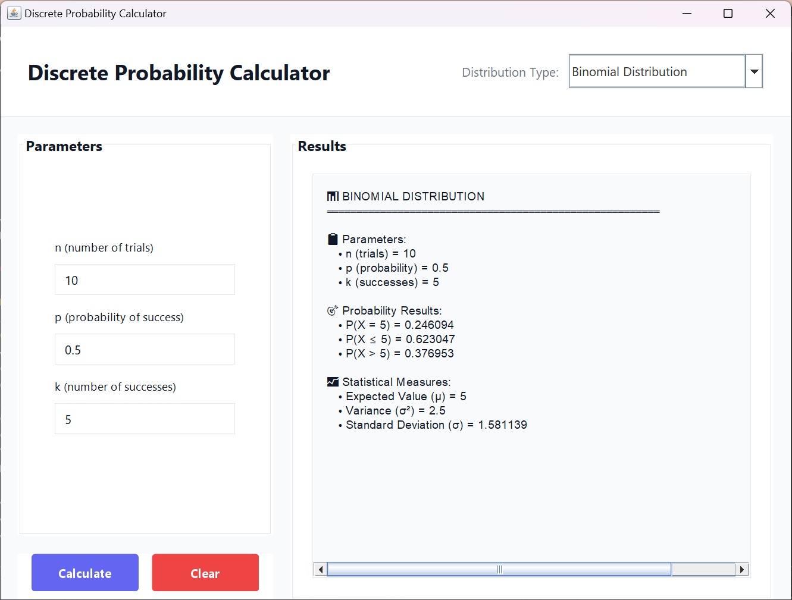

# Discrete Probability Calculator

> A modern Java GUI application for computing discrete probability distributions with professional styling and comprehensive mathematical accuracy.


[](https://github.com/AtriProjects/discrete-probability-calculator/tree/master?tab=License-1-ov-file)

---

## Overview

This application provides an intuitive interface for calculating four fundamental discrete probability distributions commonly used in statistics and probability theory. Built with modern Java Swing components featuring a clean, card-based design.

**Supported Distributions:**
- Binomial Distribution
- Poisson Distribution  
- Geometric Distribution
- Hypergeometric Distribution

---

## GUI Preview



*Modern, clean interface showing the Binomial Distribution calculation with professional styling and comprehensive results display.*

---

## Features

**Mathematical Accuracy**
- Probability Mass Function (PMF)
- Cumulative Distribution Function (CDF)
- Statistical measures (mean, variance, standard deviation)

**Modern Interface**
- Clean, card-based layout
- Dynamic parameter fields
- Professional color scheme
- Smart input validation

**User Experience**
- Real-time error handling
- Responsive design
- Comprehensive results formatting
- Cross-platform compatibility

---

## Quick Start

### Prerequisites
- Java 8 or higher

### Running the Application

**Windows:**
```bash
# Option 1: Using batch file (compiles and runs automatically)
./run.bat

# Option 2: Manual execution
java DiscreteDistributionCalculator
```

**Linux/macOS:**
```bash
./run.sh
```

### Compilation
```bash
javac DiscreteDistributionCalculator.java
```

---

## Usage Examples

**Binomial Distribution**
```
n = 10 trials
p = 0.5 probability
k = 6 successes
→ P(X = 6) = 0.205078
```

**Poisson Distribution**
```
λ = 3.5 average rate
k = 5 events
→ P(X = 5) = 0.132378
```

**Geometric Distribution**
```
p = 0.167 probability
k = 4 trials
→ P(X = 4) = 0.096451
```

**Hypergeometric Distribution**
```
N = 52 population
K = 13 success states
n = 5 draws
k = 2 successes
→ P(X = 2) = 0.274405
```

---

## Technical Specifications

**Language:** Java  
**Framework:** Swing with custom styling  
**Architecture:** Single-class desktop application  
**File Size:** ~50KB compiled  
**Memory Usage:** <100MB typical operation  

---

## Project Structure

```
├── DiscreteDistributionCalculator.java    # Source code
├── User_Guide.md                          # Documentation
├── run.bat                                # Windows launcher
├── run.sh                                 # Unix launcher
└── README.md                              # This file
```

---

## Mathematical Implementation

The application implements standard probability formulas:

**Binomial PMF:** `C(n,k) × p^k × (1-p)^(n-k)`  
**Poisson PMF:** `(λ^k × e^(-λ)) / k!`  
**Geometric PMF:** `(1-p)^(k-1) × p`  
**Hypergeometric PMF:** `[C(K,k) × C(N-K,n-k)] / C(N,n)`

All calculations include proper input validation and error handling to ensure mathematical accuracy.

---

## Team Members

- [Christian Oliver Obrero](https://github.com/ChristianOliver203/)
- [John Keano Del Rosario](https://github.com/yanoozxes/)
- [John Paul Caigas](https://github.com/mra1k3r0/)

---

## License

Open source under [MIT License](https://github.com/AtriProjects/discrete-probability-calculator/blob/master/LICENSE) 